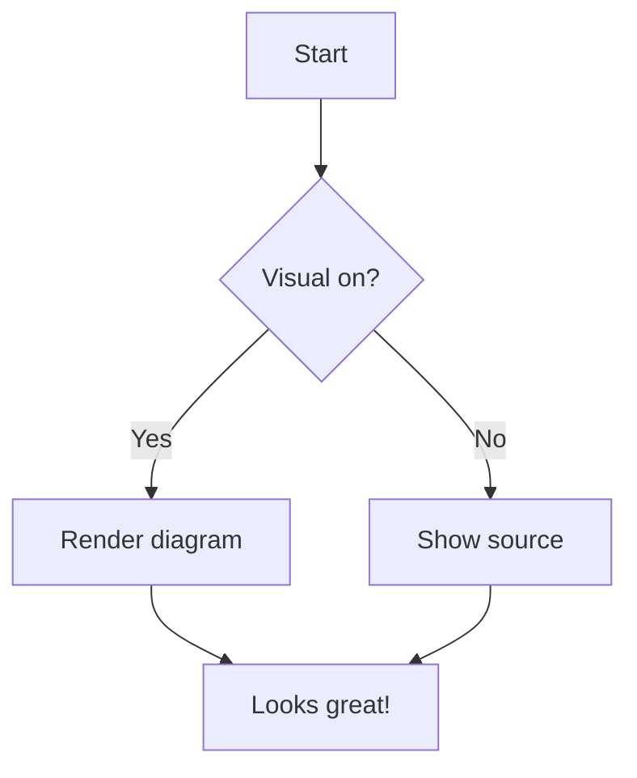

# Welcome to Edi

Edi is a fast markdown editor with Mermaid diagrams, in-line spreadsheets, executable code blocks, and more.

## Getting started

- Hover any block for its controls — **Source** shows that block's markdown and **Visual** brings the rendering back — or press `Ctrl+Shift+E` to toggle the block the caret is in.
- `Alt+click` any block to step it through its modes — a diagram through edit, a table through its spreadsheet. `Alt+Shift+click` goes back to the visual form, and `Esc` steps down one.
- Use the **File** and **View** menus for document actions.
- Open several documents side by side in tabs (`Ctrl+N` for a new tab, `Ctrl+W` to close one).
- Insert a spreadsheet, text file, or image with `Insert → …`.

## Mermaid diagrams



## Spreadsheet tables

Start a cell with `=` to compute it from other cells:

| Item | Q1 | Q2 | Total |
| --- | --- | --- | --- |
| Widget | 120 | 180 | =SUM(B2:C2) |
| Gadget | 90 | 110 | =B3+C3 |
| **Total** | =SUM(B2:B3) | =SUM(C2:C3) | =SUM(D2:D3) |

Supports {{BUILTIN_FUNCTIONS}}, cell references like `B2` and `$B$2`, and ranges like `B2:C4`.

## Executable code blocks

Add a shebang line like a shell script to make a code block runnable:

```
#!/usr/bin/env python3
print("Hello from Python!")
```

## Tasks

- [x] Fast editing
- [x] Spreadsheet tables
- [x] Executable code blocks
- [x] HTML export
- [x] Multiple tabs
- [x] Spreadsheet import
- [x] Text-file import
- [x] Image insertion
