# Ceasg Templates

## Flowchart
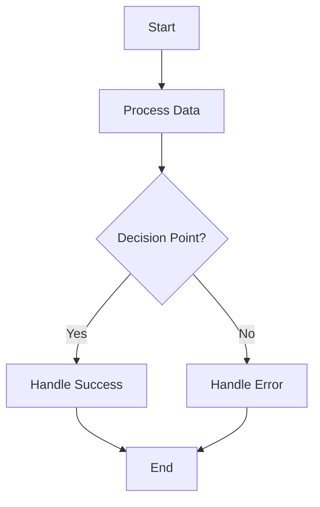
```mermaid
flowchart TD
    A["Start"] --> B["Process Data"]
    B --> C{"Decision Point?"}
    C -->|Yes| D["Handle Success"]
    C -->|No| E["Handle Error"]
    D --> F["End"]
    E --> F
```

## Class
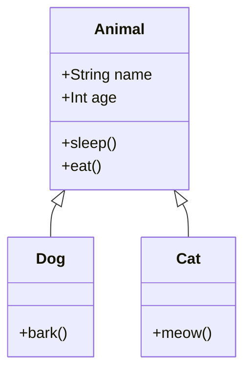
```mermaid
classDiagram
    class Animal {
        +String name
        +Int age
        +sleep()
        +eat()
    }
    class Dog {
        +bark()
    }
    class Cat {
        +meow()
    }
    Animal <|-- Dog
    Animal <|-- Cat
```

## Sequence
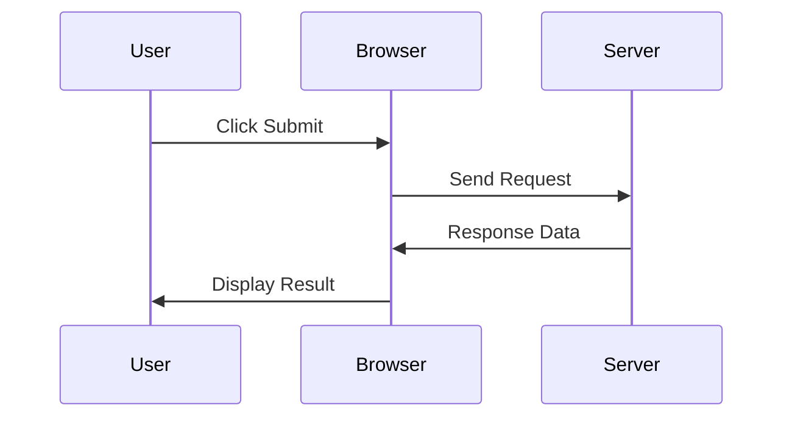
```mermaid
sequenceDiagram
    participant User
    participant Browser
    participant Server
    User->>Browser: Click Submit
    Browser->>Server: Send Request
    Server->>Browser: Response Data
    Browser->>User: Display Result
```

## Entity Relationship
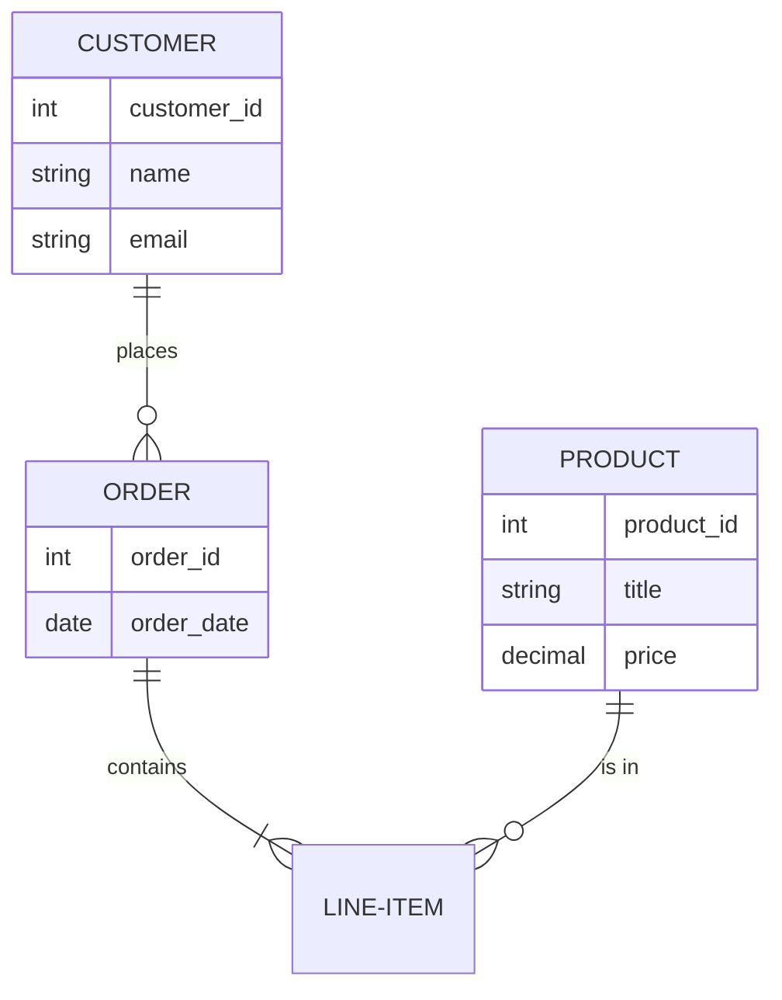
```mermaid
erDiagram
    CUSTOMER ||--o{ ORDER : places
    ORDER ||--|{ LINE-ITEM : contains
    PRODUCT ||--o{ LINE-ITEM : "is in"
    CUSTOMER {
        int customer_id
        string name
        string email
    }
    ORDER {
        int order_id
        date order_date
    }
    PRODUCT {
        int product_id
        string title
        decimal price
    }
```

## State
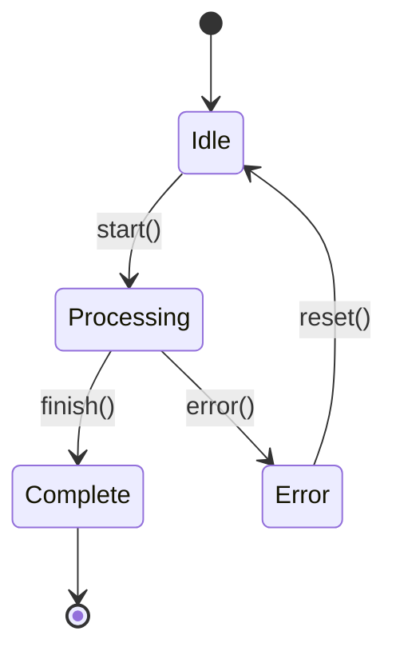
```mermaid
stateDiagram-v2
    [*] --> Idle
    Idle --> Processing: start()
    Processing --> Complete: finish()
    Processing --> Error: error()
    Complete --> [*]
    Error --> Idle: reset()
```

## Mindmap
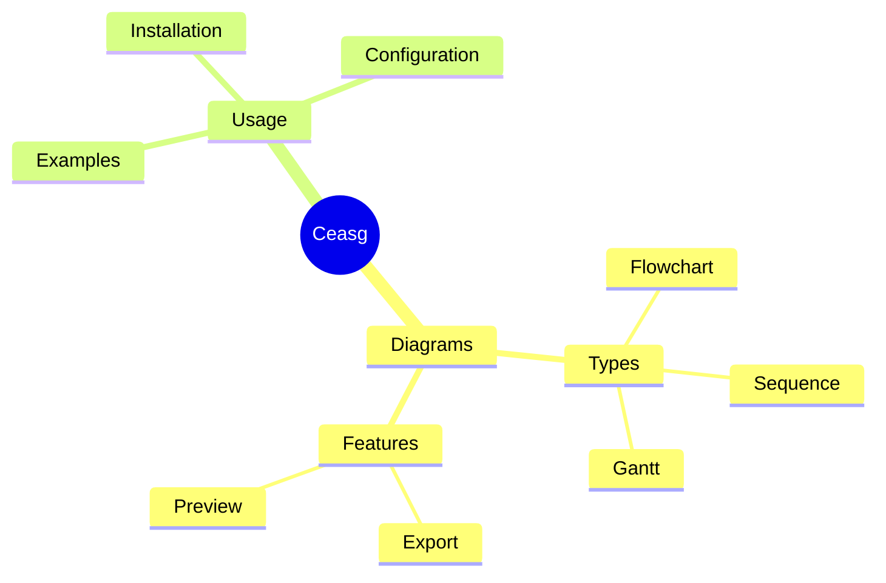
```mermaid
mindmap
  root((Ceasg))
    Diagrams
      Types
        Flowchart
        Sequence
        Gantt
      Features
        Export
        Preview
    Usage
      Installation
      Configuration
      Examples
```

## Architecture
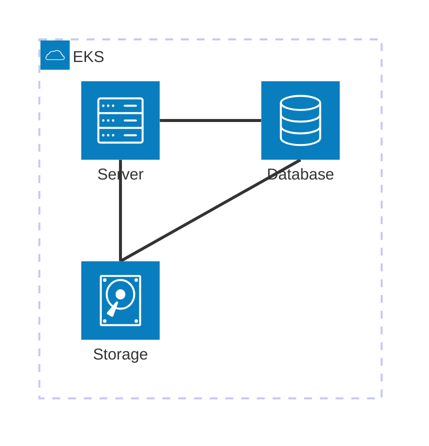
```mermaid
architecture-beta
    group api(cloud)[EKS]

    service db(database)[Database] in api
    service PVC(disk)[Storage] in api
    service server(server)[Server] in api

    db:L -- R:server
    PVC:T -- B:server
    PVC:T -- B:db
```

## Block
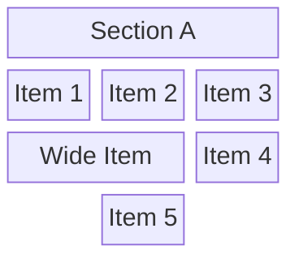
```mermaid
block-beta
    columns 3
    A["Section A"]:3
    B["Item 1"] C["Item 2"] D["Item 3"]
    E["Wide Item"]:2 F["Item 4"]
    space G["Item 5"]
```

## C4
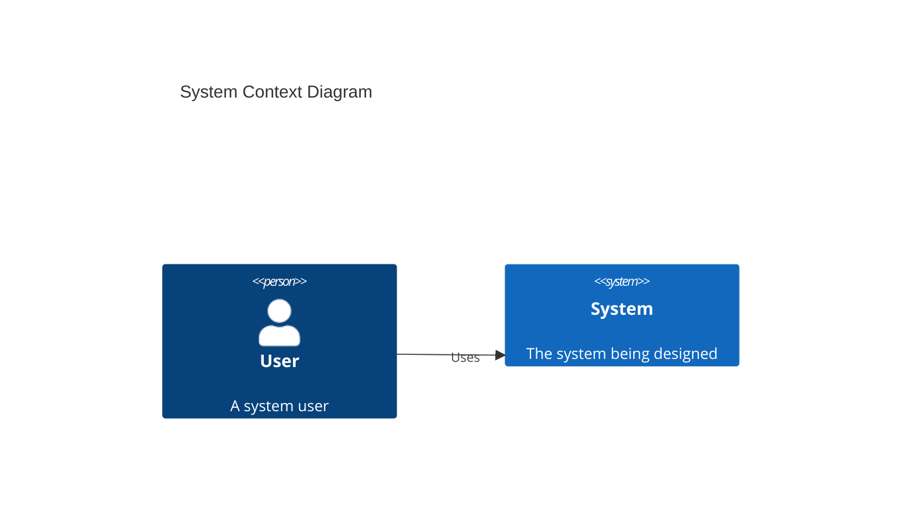
```mermaid
C4Context
    title System Context Diagram
    Person(user, "User", "A system user")
    System(sys, "System", "The system being designed")
    Rel(user, sys, "Uses")
```

## Gantt
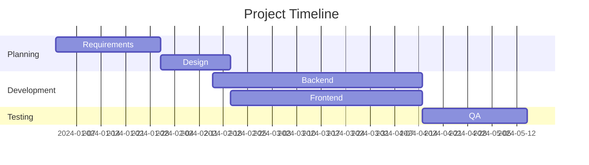
```mermaid
gantt
    title Project Timeline
    section Planning
    Requirements :req, 2024-01-01, 30d
    Design :des, after req, 20d
    section Development
    Backend :dev1, 2024-02-15, 60d
    Frontend :dev2, 2024-02-20, 55d
    section Testing
    QA :qa, after dev1, 30d
```

## Git
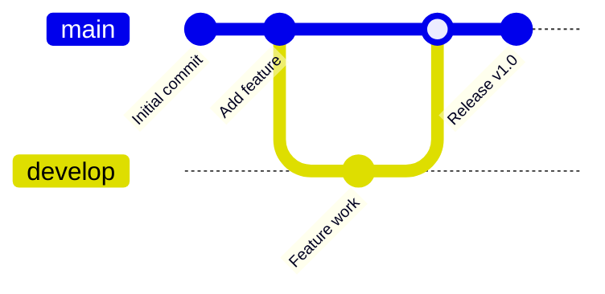
```mermaid
gitGraph
    commit id: "Initial commit"
    commit id: "Add feature"
    branch develop
    checkout develop
    commit id: "Feature work"
    checkout main
    merge develop
    commit id: "Release v1.0"
```

## Ishikawa
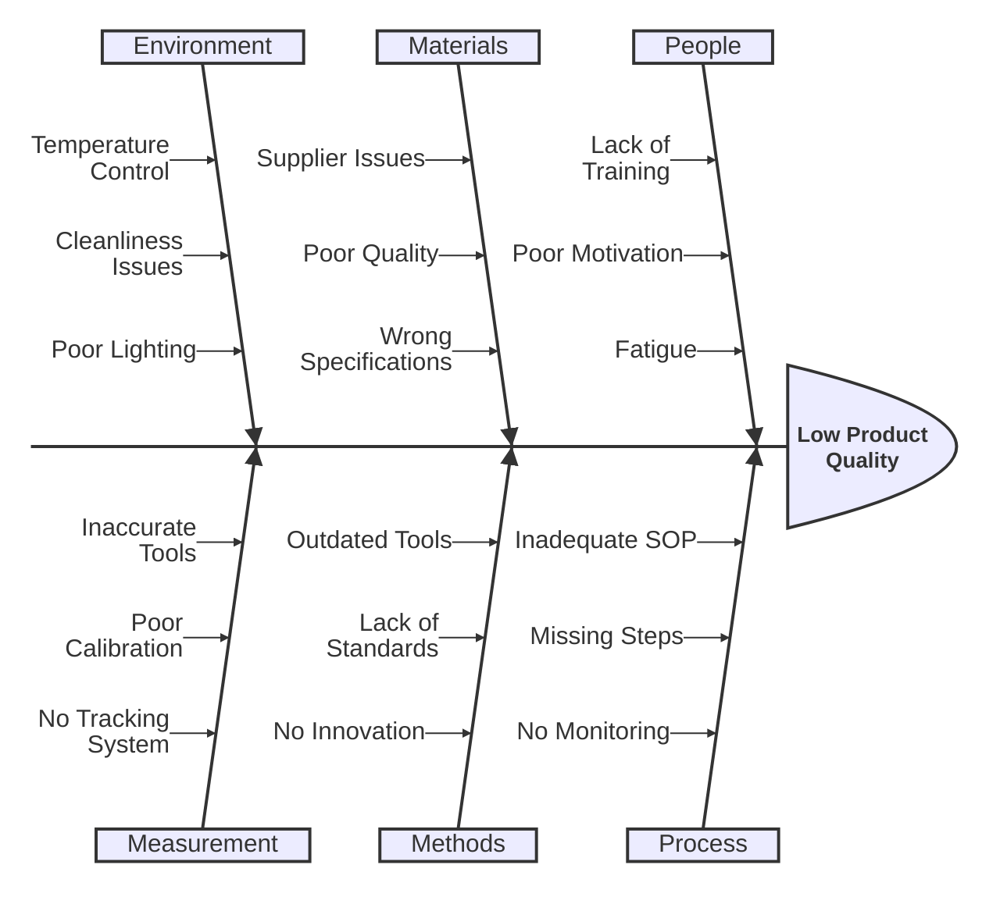
```mermaid
ishikawa-beta
    Low Product Quality
    People
        Lack of Training
        Poor Motivation
        Fatigue
    Process
        Inadequate SOP
        Missing Steps
        No Monitoring
    Materials
        Supplier Issues
        Poor Quality
        Wrong Specifications
    Methods
        Outdated Tools
        Lack of Standards
        No Innovation
    Environment
        Temperature Control
        Cleanliness Issues
        Poor Lighting
    Measurement
        Inaccurate Tools
        Poor Calibration
        No Tracking System
```

## Kanban
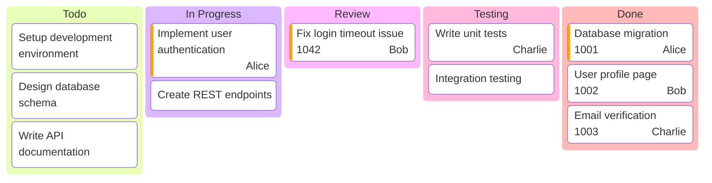
```mermaid
kanban
  Todo
    [Setup development environment]
    [Design database schema]
    docs[Write API documentation]
  [In Progress]
    feature1[Implement user authentication]@{ assigned: 'Alice', priority: 'High' }
    feature2[Create REST endpoints]
  [Review]
    bugfix1[Fix login timeout issue]@{ ticket: 1042, assigned: 'Bob', priority: 'High' }
  [Testing]
    test1[Write unit tests]@{ assigned: 'Charlie' }
    test2[Integration testing]@{ priority: 'Medium' }
  [Done]
    completed1[Database migration]@{ ticket: 1001, assigned: 'Alice', priority: 'High' }
    completed2[User profile page]@{ ticket: 1002, assigned: 'Bob' }
    completed3[Email verification]@{ ticket: 1003, assigned: 'Charlie', priority: 'Medium' }
```

## Packet
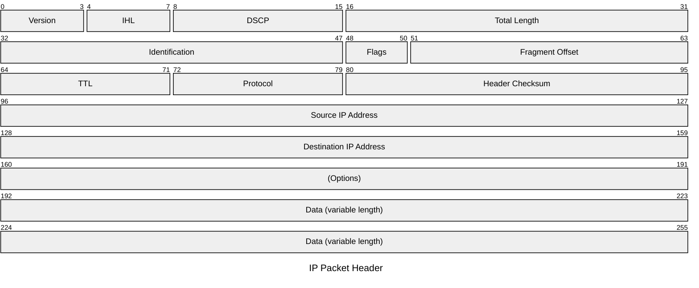
```mermaid
---
title: "IP Packet Header"
---
packet
0-3: "Version"
4-7: "IHL"
8-15: "DSCP"
16-31: "Total Length"
32-47: "Identification"
48-50: "Flags"
51-63: "Fragment Offset"
64-71: "TTL"
72-79: "Protocol"
80-95: "Header Checksum"
96-127: "Source IP Address"
128-159: "Destination IP Address"
160-191: "(Options)"
192-255: "Data (variable length)"
```

## Pie
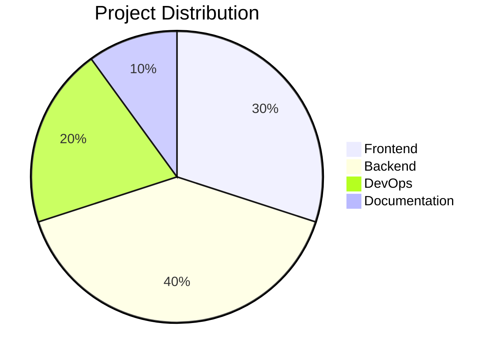
```mermaid
pie title Project Distribution
    "Frontend" : 30
    "Backend" : 40
    "DevOps" : 20
    "Documentation" : 10
```

## Quadrant
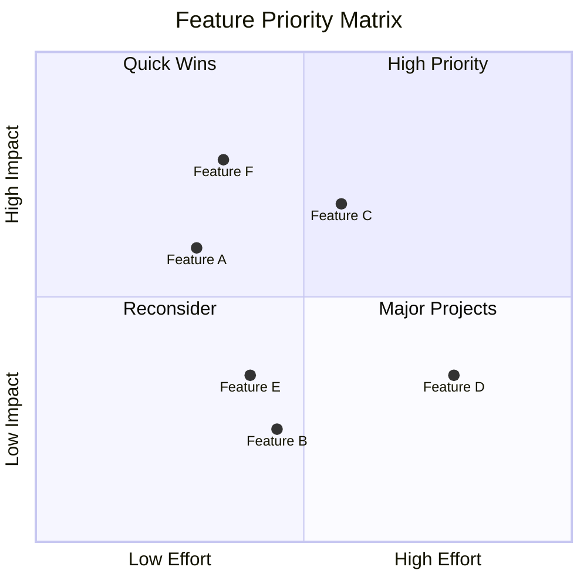
```mermaid
quadrantChart
    title Feature Priority Matrix
    x-axis Low Effort --> High Effort
    y-axis Low Impact --> High Impact
    quadrant-1 High Priority
    quadrant-2 Quick Wins
    quadrant-3 Reconsider
    quadrant-4 Major Projects
    Feature A: [0.3, 0.6]
    Feature B: [0.45, 0.23]
    Feature C: [0.57, 0.69]
    Feature D: [0.78, 0.34]
    Feature E: [0.40, 0.34]
    Feature F: [0.35, 0.78]
```

## Radar
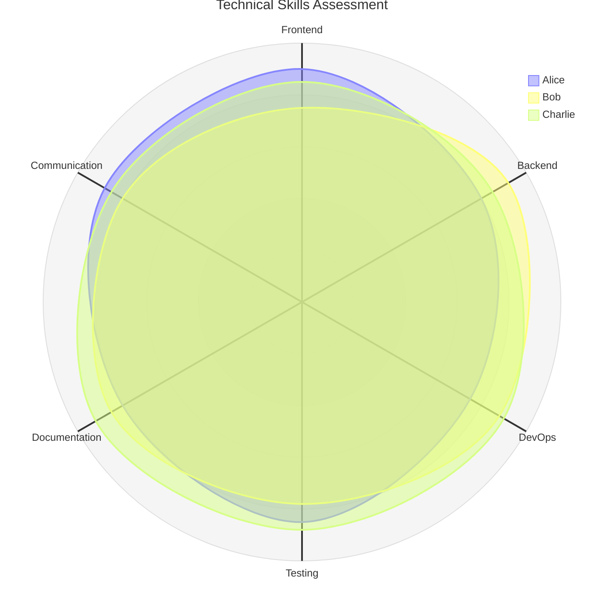
```mermaid
---
title: "Technical Skills Assessment"
---
radar-beta
  axis frontend["Frontend"], backend["Backend"], devops["DevOps"]
  axis testing["Testing"], documentation["Documentation"], communication["Communication"]
  curve alice["Alice"]{90, 80, 75, 85, 80, 88}
  curve bob["Bob"]{75, 92, 88, 78, 85, 80}
  curve charlie["Charlie"]{85, 85, 90, 88, 92, 85}
  
  max 100
  min 0
```

## Requirement
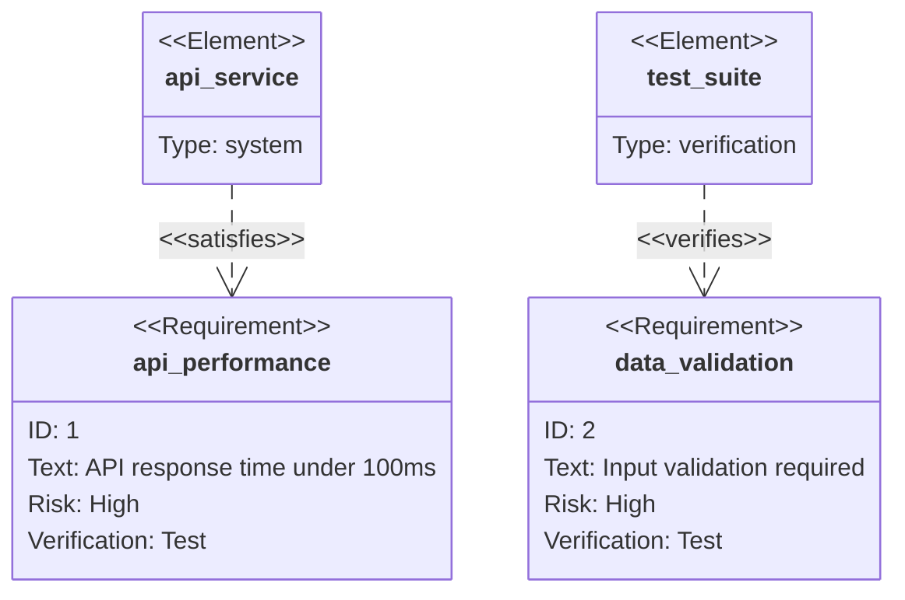
```mermaid
requirementDiagram
    requirement api_performance {
    id: 1
    text: API response time under 100ms
    risk: high
    verifymethod: test
    }

    requirement data_validation {
    id: 2
    text: Input validation required
    risk: high
    verifymethod: test
    }

    element api_service {
    type: system
    }

    element test_suite {
    type: verification
    }

    api_service - satisfies -> api_performance
    test_suite - verifies -> data_validation
```

## Sankey
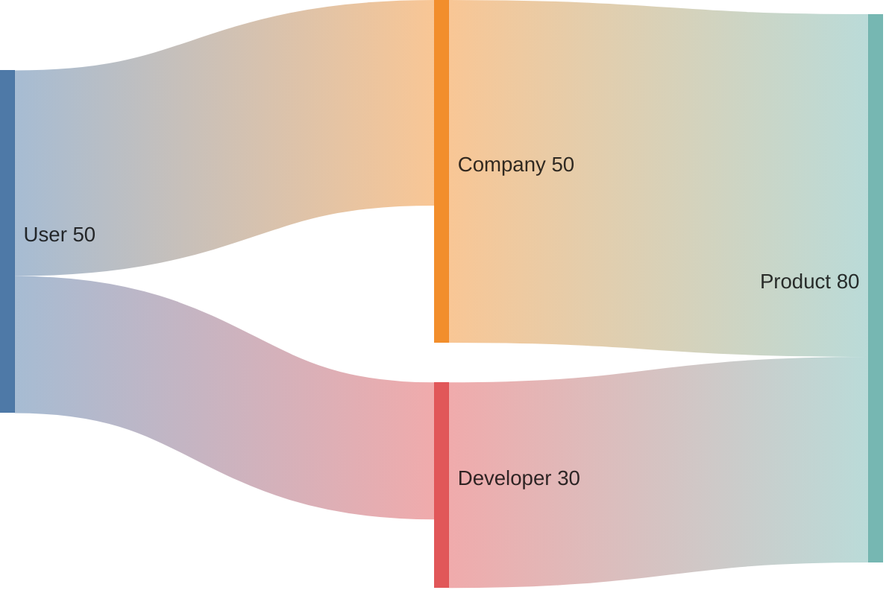
```mermaid
sankey-beta
    User,Company,30
    User,Developer,20
    Company,Product,50
    Developer,Product,30
```

## Timeline
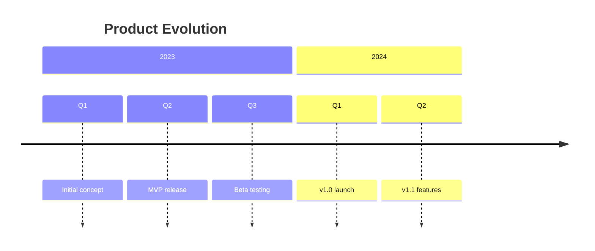
```mermaid
timeline
    title Product Evolution
    section 2023
        Q1: Initial concept
        Q2: MVP release
        Q3: Beta testing
    section 2024
        Q1: v1.0 launch
        Q2: v1.1 features
```

## TreeView
```mermaid
treeView-beta
    "Project Structure"
        "src"
            "components"
                "Header.tsx"
                "Footer.tsx"
                "Navigation.tsx"
            "styles"
                "App.css"
                "global.css"
            "utils"
                "helpers.ts"
                "constants.ts"
        "public"
            "index.html"
            "favicon.ico"
        "tests"
            "unit"
                "helpers.test.ts"
            "integration"
                "api.test.ts"
        "package.json"
        "tsconfig.json"
        "README.md"
```

## Treemap
```mermaid
treemap-beta
"Annual Budget"
    "Engineering"
        "Salaries": 500
        "Tools": 100
        "Infrastructure": 150
    "Operations"
        "Facilities": 150
        "Support": 100
    "Marketing"
        "Advertising": 100
        "Content": 50
    "Research & Development"
        "Innovation": 75
        "Testing": 50
```

## User Journey
```mermaid
journey
    title User Onboarding
    section Sign Up
        Discover Platform: 5: User
        Create Account: 4: User
    section Setup
        Configure Settings: 3: User
        Invite Team: 4: User
    section First Use
        Create Project: 5: User
        Share Results: 5: User
```

## Venn
```mermaid
venn-beta
    title "Pet Preferences"
    set Dogs
    set Cats
    union Dogs,Cats["Both"]
```

## Wardley Maps
```mermaid
wardley-beta
title E-Commerce Platform
size [1200, 800]

anchor Customer [0.95, 0.63]
anchor Business [0.95, 0.40]

component Website [0.80, 0.65] label [15, -5]
component API [0.70, 0.70]
component Database [0.60, 0.80]
component Cache [0.55, 0.45]
component Storage [0.45, 0.78]
component Load Balancer [0.35, 0.50]
component Monitoring [0.25, 0.35]
component Cloud Infrastructure [0.15, 0.72]

Customer -> Website
Business -> API
Website -> API
API -> Database
API -> Cache
API -> Storage
Database -> Cloud Infrastructure
Cache -> Cloud Infrastructure
Storage -> Cloud Infrastructure
Load Balancer -> Cloud Infrastructure
Monitoring -> Cloud Infrastructure

evolve Cache 0.75
evolve Cloud Infrastructure 0.92

note "Caching improves performance" [0.45, 0.30]
note "Cloud infrastructure is mature" [0.15, 0.55]
note "API design critical for platform" [0.70, 0.55]
```

## XY
```mermaid
xychart-beta
    title "Website Traffic Analysis"
    x-axis [jan, feb, mar, apr, may, jun, jul, aug, sep, oct, nov, dec]
    y-axis "Visitors (in thousands)" 10 --> 100
    line [25, 35, 45, 55, 65, 75, 80, 75, 70, 60, 45, 35]
    bar [20, 32, 42, 50, 60, 72, 78, 70, 65, 55, 40, 30]
```